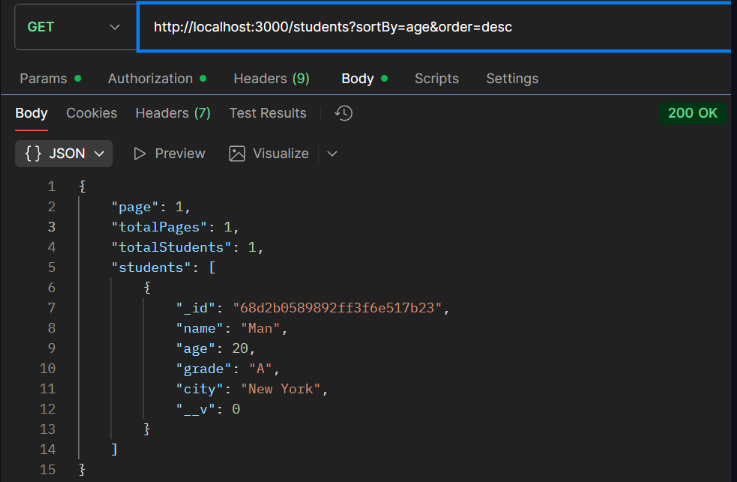
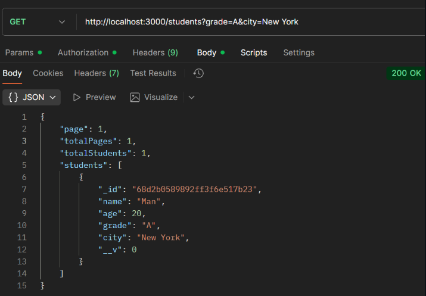

# Experiment 14: Pagination, Filtering, and Sorting

## Objective
Implement pagination, filtering, and sorting for a resource (Students) using Node.js, Express, and MongoDB.

## Steps
1. Setup Node.js project and install dependencies.
2. Create .env for PORT and MongoDB URI.
3. Create Student model with fields: name, age, grade, city.
4. Implement Express routes:
   - POST /students → Add a student
   - GET /students → List students with:
       - Pagination: page & limit
       - Filtering: grade & city
       - Sorting: sortBy & order
5. Test using Postman:
   - Add multiple students
   - Retrieve students using queries like:
     - /students?page=1&limit=2
     - /students?grade=A&city=New York
     - /students?sortBy=age&order=desc

## Screenshots
*App Screenshot*:

## Notes
- Default page = 1, limit = 5
- Sorting order: asc (ascending) / desc (descending)
- Filtering fields are optional
